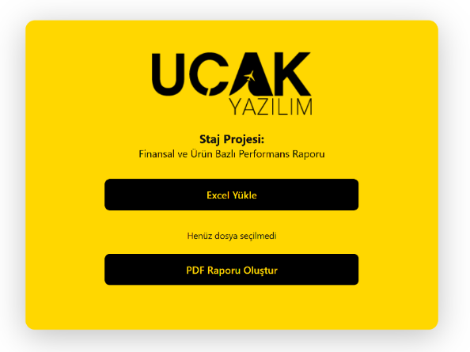
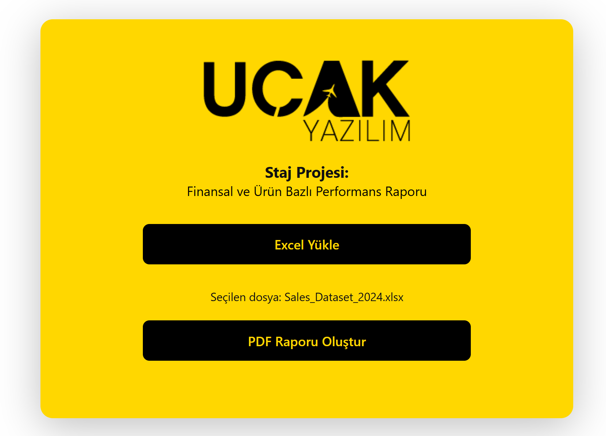
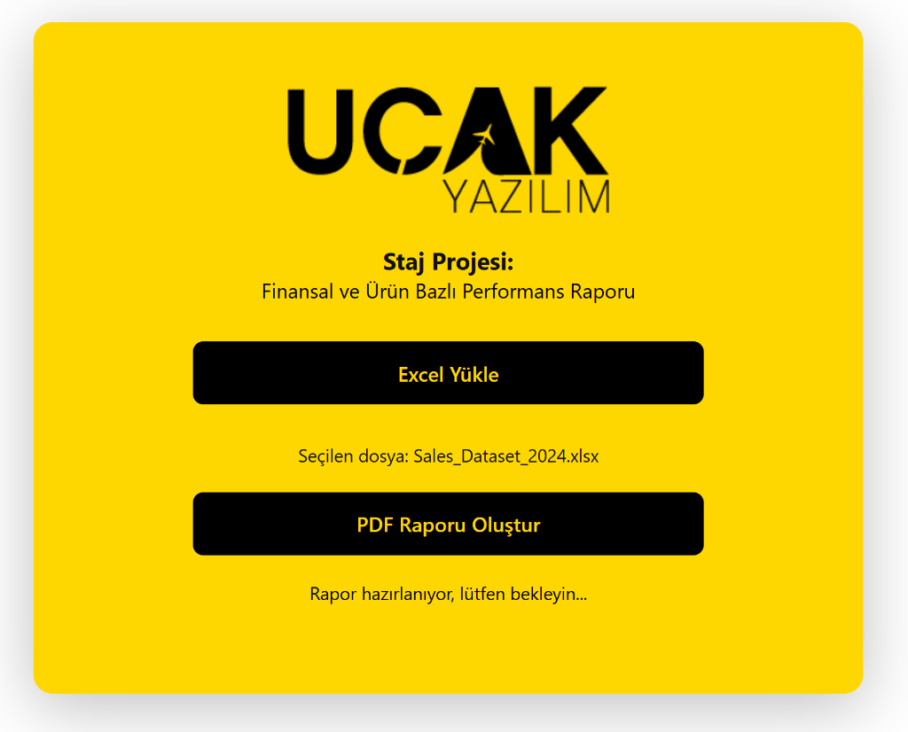

# AI & ML Based Financial Reporting & Decision Support System

A professional Flask-based financial analysis application that dynamically processes uploaded datasets, applies machine learning models for performance prediction, and generates comprehensive PDF reports enhanced by AI-generated insights.

<p align="center">
  
  
  
  
  
</p>

---

## 📌 Project Overview
This system was developed as a core component of a software engineering internship at **UCAK YAZILIM**. It serves as a decision support platform that bridge the gap between raw financial data and actionable managerial insights. By combining traditional statistical analysis with modern AI interpretation, it provides a holistic view of branch and product performance.

## 🖼️ Interface Screenshots

### 1. Initial State
The landing page of the application where users can start by uploading their financial Excel datasets.
<p align="center">
  
</p>

### 2. Dataset Selected
Once a valid Excel file is selected, the system prepares for processing and model training.
<p align="center">
  
</p>

### 3. Processing & AI Generation
The system performs regression analysis and calls the Llama 3 model via Ollama to generate strategic insights.
<p align="center">
  
</p>

## 📄 Sample Report Output
Explore an example of the automatically generated PDF report:
👉 **[View Sample Report (PDF)](assets/Finansal_Analiz_Raporu.pdf)**

---

## 🎯 Key Features
- **Smart Data Ingestion:** Direct support for Excel (`.xlsx`) datasets with automated structure validation.
- **Automated Preprocessing:** Intelligent handling of missing values (NaN), column standardization, and numeric data extraction.
- **Predictive Analytics:** Uses **Linear Regression** to predict expected profits and identify performance outliers.
- **Quantile-Based Risk Scoring:** Sophisticated classification of branch performance into *Low*, *Medium*, and *High Risk* categories based on profit deviation.
- **AI-Powered Narrative:** Integrates **Ollama (Llama 3)** to generate professional financial commentary and strategic recommendations in Turkish.
- **Professional PDF Generation:** Dynamic report creation using **ReportLab**, featuring structured tables and AI-driven executive summaries.

---

## 🧠 Technical Implementation

### Machine Learning Engine
The system utilizes a supervised learning approach to establish a performance baseline:
- **Model:** Linear Regression (Scikit-learn)
- **Features:** Revenue, Expense
- **Target:** Profit
- **Metrics:** R² score is calculated to ensure model reliability.
- **Deviation Analysis:** 
  $$\text{Deviation (\%)} = \frac{\text{Actual Profit} - \text{Predicted Profit}}{\text{Predicted Profit}} \times 100$$
  This metric allows the system to identify which branches are overperforming or underperforming relative to the statistical trend.

### AI Integration (Ollama)
The application leverages the **Llama 3** model (via Ollama) to interpret the data summary. It acts as a virtual financial consultant that:
1. Analyzes branch-specific statistics.
2. Identifies strong and weak product lines.
3. Provides 5 key strategic recommendations for management.

---

## 🛠️ Tech Stack
- **Backend:** Python / Flask
- **Data Science:** Pandas, Scikit-learn
- **AI:** Ollama / Llama 3
- **Reporting:** ReportLab
- **Data Source:** OpenPyXL (Excel integration)
- **Frontend:** HTML5, CSS3 (Modern UI with Glassmorphism effects)

---

## 📂 Dataset Requirements
The system is optimized for a specific financial schema including:
- `Region`: Branch or region name
- `Product`: Product category
- `Revenue`: Total income
- `Expense`: Total costs
- `Profit`: Net profit
- `Units_Sold`: Quantity sold

---

## 🚀 Installation & Setup

### 1. Prerequisites
- Python 3.8+
- [Ollama](https://ollama.ai/) installed and running (`llama3` model downloaded)

### 2. Setup Environment
```bash
# Create virtual environment
python -m venv venv

# Activate environment
# Windows:
venv\Scripts\activate
# macOS/Linux:
source venv/bin/activate
```

### 3. Install Dependencies
```bash
pip install -r requirements.txt
```

### 4. Run Application
```bash
python app.py
```
Visit `http://127.0.0.1:5000` in your browser.

---

## 🔍 Roadmap & Future Versions
The current version (v1.0) establishes the analytical core. Future updates will include:
- **Dynamic Feature Selection:** Allow users to map their own columns to ML inputs.
- **Model Switching:** Choice between Regression (Profit) and Classification (Risk Level).
- **Multi-Model AI Support:** Integration with GPT-4 or Claude via API.
- **Enhanced Visualization:** Interactive charts (Plotly/D3.js) within the web interface.

---

## 📈 About the Project
This project demonstrates the practical application of AI and Machine Learning in automating professional workflows. It was designed to provide a robust foundation for automated financial reporting systems, emphasizing clean code, modular architecture, and user-centric design.

Developed by **AYceren11** during the Software Engineering Internship program.